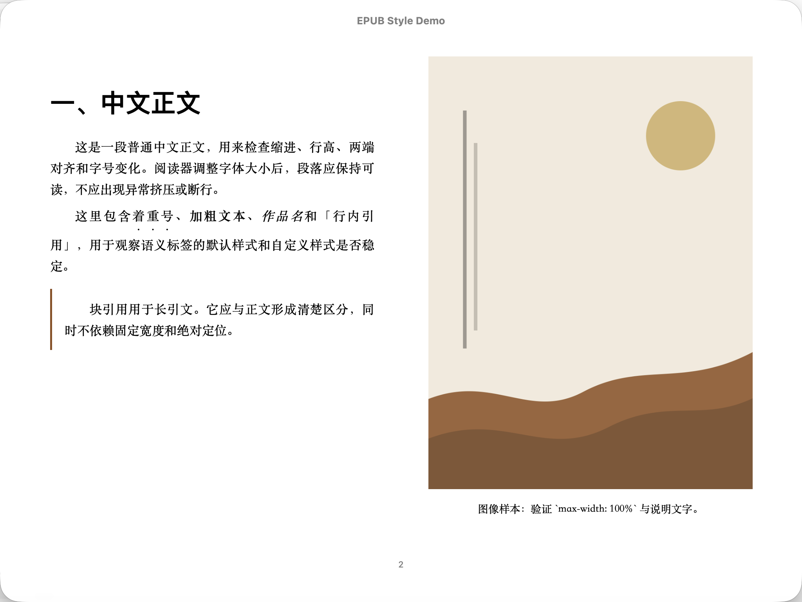

# EPUB 是什么

如果你第一次接触电子书制作，先从这里开始。你不需要先懂排版术语，也不需要先读完整手册。

## 一句话解释

EPUB 是一个装着 HTML、CSS、图片和目录的 zip 包。电子书阅读器打开它，再根据屏幕大小和你的字号设置重新排版文字。

这也是它和 PDF 最大的区别：PDF 更像印好的纸张，EPUB 更像一个可以自动换行的网站。

## 阅读器打开 EPUB 时发生了什么

当你双击一本 `.epub`，阅读器做了这 5 件事：

1. **验证身份** — 读 ZIP 的第一个 entry（`mimetype`），确认是 `application/epub+zip`。不是的话直接拒绝。
2. **找到入口** — 解包 `META-INF/container.xml`，找到 [OPF](glossary.md#opf) 文件（项目文件）的位置，通常是 `OEBPS/package.opf`。
3. **建立清单** — 解析 OPF 的 [manifest](glossary.md#manifest)，知道这本书有哪些文件（正文、样式、图片、字体）。
4. **按顺序加载** — 按 OPF 的 [spine](glossary.md#spine) 顺序逐个打开正文 XHTML 文件。
5. **渲染** — 对每个 XHTML，加载它引用的 CSS、图片、字体，按屏幕尺寸和用户字号设置重新排版。

任何一步出错，书就可能打不开或显示异常。这也就是为什么同一本书在不同阅读器里表现不一样——每个阅读器实现这 5 步的方式不完全相同。

目录通常由 EPUB 3 的 [nav.xhtml](glossary.md#navxhtml) 提供；兼容 EPUB 2 或 Kindle
转换路径时，还会遇到 [NCX](glossary.md#ncx)。

## 为什么同一本书在不同阅读器里会不一样

Apple Books、Kindle、多看和其他阅读器对样式的支持不完全相同。同一本书可能在一个阅读器里正常，在另一个阅读器里出现目录失效、注释打不开、图片溢出或字号变大后页面挤坏的问题。

具体的例子：

- **目录失效**：OPF manifest 漏标记 `properties="nav"`，或 `toc.ncx` 的 `dtb:uid` 与 OPF identifier 不一致，Kindle 认不出目录。
- **注释打不开**：正文缺少 `xmlns:epub` 声明，或 `epub:type="noteref"` 与目标 `<aside epub:type="footnote">` 不在同一个 XHTML 文件里。
- **图片溢出**：图片使用了 `width:100%` 但外层容器的 padding 额外撑开，导致图片超出屏幕右边界。
- **字号变大后错位**：排版依赖了固定宽高值如 `px` 或 `vh`/`vw`，而不是可缩放的 `em`/`%`。

这个仓库要解决的是：怎样做一本在常见阅读器里都不容易崩的中文 EPUB，以及怎样把别人做坏的 EPUB 清洗干净。

## EPUB 版本简史

EPUB 标准经历了几次重要演进：

| 版本 | 年份 | 组织 | 关键变化 |
| --- | --- | --- | --- |
| EPUB 2.0 | 2007 | IDPF | 确立了 OPF + NCX + XHTML 的基本架构，至今仍有大量存量书 |
| EPUB 3.0 | 2011 | IDPF | 引入 `nav.xhtml`、`epub:type` 语义、MathML、Ruby、CSS 3 子集 |
| EPUB 3.0.1 | 2014 | IDPF | 维护修订，修正勘误 |
| EPUB 3.3 | 2023 | W3C | IDPF 已于 2017 年并入 W3C；EPUB 3.3 是首个 W3C 推荐标准，清理了过时引用，更贴近现代 Web 标准 |

今天你看到的 EPUB 书可能版本各异：新书大多是 EPUB 3，但大量存量公版书仍是 EPUB 2，中文自制书则常常介于两者之间的"混搭"状态。

> 版本差异的细节和兼容策略见 [08-epub2-epub3-compatibility.md](08-epub2-epub3-compatibility.md)。

## 平台生态：同一个 EPUB，不同的命运

EPUB 标准是一回事，各家阅读器的实现是另一回事：

- **Apple Books**（macOS / iOS）：对 EPUB 3 和现代 CSS 支持最完整，是本仓首选基线。但它会强缓存——重新导入前必须删除旧书。
- **Kindle / KDP**（Amazon）：不原生支持 EPUB 3。作者上传 EPUB，由 Kindle Previewer 转换为 KFX/AZW3。转换过程会降级或丢弃部分 CSS 属性。Kindle 依赖 NCX 做导航，需要 `properties="cover-image"` 做封面声明。
- **多看阅读**：对中文排版细节敏感，但弹注机制与 EPUB 3 标准不同，需要专用 fallback 结构（`duokan-footnote` class）。
- **Readium 生态**：开源阅读系统工具链。Thorium Reader 是基于 Readium Desktop 的跨平台阅读器，适合作为重排对照。KOReader 面向电子墨水设备，CSS 策略更保守。
- **Readest**：新兴跨平台阅读器，中文 EPUB 体验友好，支持用户覆盖字体与主题。

"什么阅读器都不是 bug-free 的完美实现"是理解兼容性的起点。本仓把每个兼容性结论都记录在 [reader-matrix.yaml](../final/reader-matrix.yaml) 中，附阅读器名称、版本和实测情况。

> 各平台具体兼容策略见 [08-epub2-epub3-compatibility.md](08-epub2-epub3-compatibility.md) §6。

## 这个仓库帮你做两件事

1. **从零学着排一本书**：先跟着 [01-first-epub.md](01-first-epub.md) 构建示例，再裁出你自己的最小书。
2. **清洗一本现成 EPUB**：按 [清洗流水线](../pipeline/cleanup-flow.md) 保留原件、检查风险、生成清洗结果，再人工对比改前改后。

## 你不需要先会什么

- 不需要先背 EPUB 规范。
- 不需要先懂所有 CSS 属性。
- 会在命令行复制粘贴命令即可。
- 遇到不懂的词，先查 [术语表](glossary.md)。

## 先看一眼正常效果

下面是同一个 demo 在 Apple Books 8.5 中的真实渲染。正文应能随着窗口和字号变化保持可读。

弹注图标点开前：

弹注图标点开后，注释应直接在阅读页内出现：

截图的 demo 版本、阅读器版本和场景记录见 [images/README.md](images/README.md)。

## 下一步

继续阅读 [01-first-epub.md](01-first-epub.md)，5 分钟构建第一本示例 EPUB。
