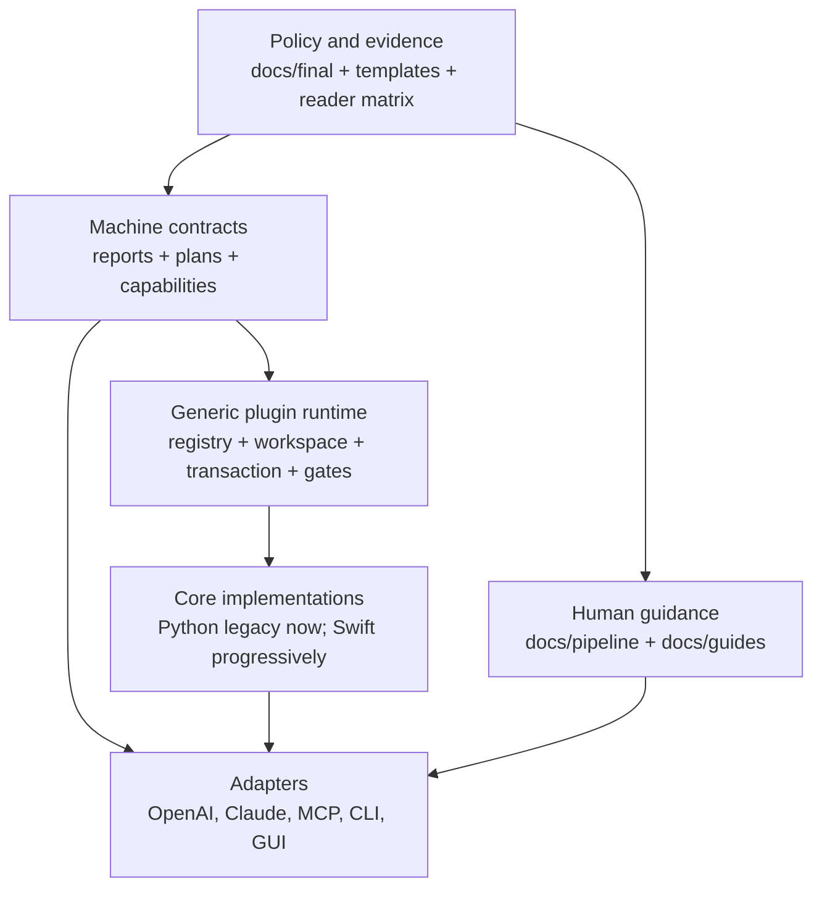

# epub-handbook 三层项目重构计划

> 状态：R0 已登记 Python 公开入口；R1 已落地；R2 已有 catalog 与 Python-only JSON bridge；R3 已有 Swift 原生 transaction 基座。Python / Swift 双跑、完整 redline 与 popup 写入仍待继续。
>
> 主方案来源：
> - `/Users/xiaoxiao/Developer/docCs/epub-handbook/epub-handbook 架构重构深度研究报告.md`
> - `/Users/xiaoxiao/Developer/docCs/epub-handbook/liyafly epub-handbook 重构研究报告.md`
> - `/Users/xiaoxiao/Developer/docCs/epub-handbook/执行摘要.md`

## 目标

本次重构不是移动目录，也不是将 Python 改写成 Swift。目标是把现有系统拆成稳定的三层，同时**保留现有 Python 代码、Markdown skill 和 harness 作为可运行的兼容实现**：

```text
1. Agent-neutral core
   EPUB container、OPF/XHTML/CSS、注释替换、红线校验、报告与错误模型。

2. Python plugin layer
   manifest 驱动的 Python skill / harness、registry、workspace、gate、transaction、execution plan；只服务现有 CLI 与 AI Agent。

3. Agent and product adapters
   OpenAI、Claude Code、MCP、CLI、未来 macOS/iOS GUI 的 prompt、工具清单、命令描述、schema 投影。
```

最终效果是：

- skill 的身份由版本化 capability manifest 决定，`SKILL.md` 与 `agents/openai.yaml` 成为现有 agent 的适配表面，而非唯一存在条件；
- harness 用 capability、步骤、依赖和 gate 表达工作流，不把 `python3 scripts/*.py` 命令字符串当成工作流本体；
- Python 脚本继续是 AI Agent、现有 CLI 与验证基线的首要 provider；Swift 是 Apple 原生核心与 GUI 的首要 provider；两者按 capability 并存，而不是默认删除 Python；
- GUI、CLI、OpenAI、Claude Code、MCP 都使用同一份 `InspectionReport` 和 `ExecutionPlan`，只在 adapter 层有不同展示。

## 现状诊断

| 当前资产 | 当前价值 | 结构问题 | 重构后的归属 |
|---|---|---|---|
| `docs/final/`、`templates/`、`reader-matrix.yaml` | 规则有 demo 与阅读器实测支撑。 | 机器调用只能靠散落的文档链接和脚本约定。 | 继续是 policy / evidence 的唯一来源；不迁移。 |
| `scripts/epub_lib.py`、structure/package/lint/validator | 已有可运行的 EPUB 处理核心。 | 核心函数、公开 CLI、编排器、测试同处 `scripts/`，以 `sys.path` 导入。 | 保持 Python runtime；逐项登记为 legacy capability provider。 |
| `epub_ai_harness.py`、preflight/refinement/pipeline | 已实现路由、建议、gate、回滚的雏形。 | findings、skill 名、命令字符串、工具探测混在一个 report。 | 分拆为 inspection、plan、runtime event、adapter projection。 |
| `skills/*/SKILL.md`、`agents/openai.yaml` | 15 个 agent 可读的排版 / 转换契约。 | skill 身份受目录、frontmatter、OpenAI metadata、validator 中硬编码表共同决定。 | 保留为 agent adapter；新增 manifest 作为中立 identity。 |
| `scripts/test_*.py`、demo validators、GitHub workflow | 已有很强的回归与 EPUBCheck 链路。 | CI 只有 Python/demo 主路径，无法覆盖新增 runtime 与 macOS 工程。 | 增加 contract、Python compatibility、Swift core、macOS app 四类 job。 |

### 必须保留的行为

1. 现有 `scripts/*.py` 路径、公开参数、exit code 与 JSON 形状在迁移期不破坏。
2. 当前 skill slug，例如 `$epub-layout-auditor`，继续可被 agent 触发。
3. `docs/final/`、demo fixture、reader matrix 的优先级不变；机器 contract 不能反向宣布 EPUB 规则。
4. before 基线、preflight、dry-run 批准、文本不变性、人工 diff review 和 reader 实测闭环不变。
5. 生成 EPUB、KPF、临时 work 目录仍不进入 Git。

## 三层架构



### 第一层：与 agent 无关的核心能力

核心只认识文件、EPUB 结构、规则、变换、报告和错误。它不认识 prompt、`SKILL.md`、`openai.yaml`、AppKit、SwiftUI 或 shell command。

| 核心能力 | 当前 Python 来源 | 统一 contract 输出 |
|---|---|---|
| archive / 路径安全 / `mimetype` | `epub_lib.py`、`epub_structure_tool.py` | `ArchiveReport`、`Finding` |
| container / OPF / manifest / spine / nav | `epub_lib.py`、`epub_ai_harness.py`、`epub_lint.py` | `PackageSnapshot`、`InspectionReport` |
| preflight | `epub_preflight_harness.py` | `InspectionReport` + blocker gate |
| 文本、锚点、metadata、cover 红线 | `validate_text_invariance.py` | `ValidationReport` |
| XHTML 最小变换 | `epub_xhtml_transforms.py` | `PatchPlan`、`TransformReport` |
| popup footnote | popup skill、converter、popup validator | `PatchPlan`、`ValidationReport` |
| 结构规范化 | `epub_structure_tool.py` | `NormalizePlan`、`PathMap`、审批 gate |

核心的错误模型分为：`Finding`（可报告）、`RecoverableError`（停止当前 capability，但可继续只读分析）和 `FatalError`（中止 transaction）。任何 apply 只能在显式 gate 通过后写入新的 output artifact。

### 第二层：Python 通用插件层

这层吸收今天 skill/harness 的语义，但不删除它们。

这层以 Python 实现；它的 skill / harness 生命周期固定为 register、discover、prepare、inspect / plan、execute、validate、commit / rollback、shutdown。Swift GUI 不实现或调用任何 skill / harness。

生命周期固定为：

```text
register → discover → prepare → inspect / plan → execute → validate
         → commit / rollback → shutdown
```

| 类型 | 责任 | 当前迁移来源 |
|---|---|---|
| `CapabilityManifest` | 中立 ID、版本、输入输出 schema、redline、权限、旧 skill slug。 | 新增；不从 Markdown 自动猜测。 |
| `SkillRegistry` | 注册 implementation、解析 capability 版本、探测可用性。 | `epub_ai_harness.py` 的 detector / routing 雏形。 |
| Python skill plugin | 一个单一能力的 inspect、plan 或 transform。 | popup note、text invariance、package inspection 等。 |
| Python harness plugin | 多 capability 编排、依赖、人工确认、事务和 event stream。 | preflight、refinement、cleanup pipeline。 |
| `Workspace` | before、after、reports、临时资源与 input digest。 | `epub_cleanup_pipeline.py` 的 work-dir 语义。 |
| `Gate` | preflight、dry-run、redline、manual review 的阻断条件。 | 现有 Python validators 和 AGENTS 流程。 |
| `Transaction` | staged output、commit / rollback、审计记录。 | pipeline 失败时删除 after 的现有行为。 |

`ExecutionPlan` 只能包含 capability ID、输入 artifact、依赖、参数、required gate 和人工确认要求。它**不能**包含 `python3 scripts/...`、OpenAI prompt 或 UI 文案。

### 第三层：agent 与产品适配层

| Adapter | 输入 | 输出 | 当前资产如何保留 |
|---|---|---|---|
| OpenAI | `CapabilityManifest` + `ExecutionPlan` + `AgentRecommendation` | `SKILL.md` 路由、`agents/openai.yaml`、工具描述。 | 现有目录保持原样，先作为兼容 adapter。 |
| Claude Code | 同上 | prompt、工具清单、步骤说明。 | 由新 adapter 输出，不改写核心。 |
| MCP | 同上 | tool schema、request / response JSON。 | 后续新增，不影响 skill 目录。 |
| CLI | `ExecutionPlan` / `RunReport` | 参数、JSON、JSONL event、exit code。 | 现有 Python CLI 继续运行；新 CLI 逐项接管。 |
| GUI | `InspectionReport`、`ExecutionPlan`、`RunEvent` | AppKit/UIKit view model。 | 不读取 skill Markdown，也不拼 shell command。 |

`agents/openai.yaml` 目前被 `validate_skills_basic.py` 强制要求，而 `skills/README.md` 将其描述为可选 metadata。这是当前不一致点。重构期间保留 validator 行为；只有新的 adapter validator、15 个 skill 映射和兼容测试都存在后，才能把它真正降级为可选 adapter。

## Contract 与目录设计

`docCs` 报告提出 `skills/contracts`、`skills/adapters`。当前仓库将 `skills/` 视为 agent 行为契约并对其目录施加强校验，因此采用等价但更隔离的落点：根级 `contracts/` 保存机器 schema，根级 `adapters/` 保存跨表面投影；`skills/` 继续保存 agent-readable 内容。

```text
epub-handbook/
├── contracts/
│   ├── schemas/v1/
│   │   ├── inspection-report.schema.json
│   │   ├── execution-plan.schema.json
│   │   ├── run-report.schema.json
│   │   └── capability-manifest.schema.json
│   └── capabilities/v1/
│       ├── epub.package.inspect.json
│       ├── epub.text.invariance.json
│       └── epub.notes.popup-normalize.json
├── adapters/
│   ├── openai/
│   ├── claude/
│   ├── mcp/
│   └── cli/
├── scripts/                         # 原位置保留
│   ├── epub_*.py                    # 既有 public CLI
│   ├── legacy/                      # 仅在明确废弃某个 Python provider 后才使用
│   └── dev/                         # 最后才收拢非公开开发辅助
├── skills/                          # 原位置保留，现有 token 不变
├── swift/                           # 由第二份计划负责
├── gui/                             # 由第二份计划负责
├── templates/ docs/ records/
└── .github/workflows/
```

### Manifest 最小形状

```json
{
  "schemaVersion": "1",
  "id": "epub.notes.popup-normalize",
  "version": "1.0.0",
  "kind": "transformer",
  "legacySkillSlugs": ["epub-popup-footnote-converter"],
  "inputSchema": "contracts/schemas/v1/inspection-report.schema.json",
  "outputSchema": "contracts/schemas/v1/run-report.schema.json",
  "redLines": ["text", "anchors", "metadata"],
  "permissions": { "requiresWriteAccess": true, "network": "none" },
  "requires": ["epub.package.inspect"],
  "adapters": ["openai", "claude", "mcp", "cli"]
}
```

manifest 不出现 Python 文件路径、Swift type 名、GUI 文案或模型 prompt。它声明“能力是什么”；registry 决定“当前由谁实现”；adapter 决定“如何呈现”。

## 保留 Python、skill 与 harness 的迁移方式

### Python

Python 不会被改为 Swift shim，也不会在第一阶段移动目录。

1. 每个现有 Python command 先登记为一个 capability provider。
2. Python 对新 schema 的适配由 `PythonProviderAdapter` 完成：输入是 request JSON，输出是 normalized report JSON。
3. 新 Swift implementation 完成双跑后，registry 可同时登记 Python 与 Swift provider；旧 Python CLI 和 agent 默认仍保持 Python provider。
4. GUI 从第一天只调用 Swift provider；未迁移 capability 在 GUI 中显示为 unavailable，不偷偷调用本机 Python。
5. Python provider 只在用户明确决定废弃该能力、经历一个稳定发布周期且所有公开入口已有 compatibility test 后，才评估移入 `scripts/legacy/` 并保留 root shim；这不是 Swift 接管后的默认动作。

### Skill

`SKILL.md` 继续承担人类和 agent 可读的流程、禁止事项、验证要求；不把它删除或改成 Swift 文档。每个 skill 逐步增加到 capability manifest 的显式映射：

```text
$epub-popup-footnote-converter
  → epub.notes.popup-normalize
  → PythonProviderAdapter（CLI / Agent）
  → OpenAI / Claude / MCP / CLI adapters

Swift 的 `PopupNoteTransformer` 是同一 contract / fixture / validator 下的原生实现，不是 skill，也不读取 `SKILL.md`。
```

### Harness

现有 harness 继续保持现有入口和输出。新 runtime 中的对应关系为：

| 现有 harness | 新的中立职责 | 第一阶段处理 |
|---|---|---|
| `epub_ai_harness.py` | capability discovery、finding collection、agent recommendation projection。 | 保留原 CLI；提炼 discovery contract。 |
| `epub_preflight_harness.py` | Python preflight harness：只读 inspection + blocker gate。 | 保持 Python，作为 CLI / Agent provider。 |
| `epub_refinement_harness.py` | `RefinementHarness`：由 facts 生成 plan，不写入。 | 先保持 Python，等 contract 稳定再迁移。 |
| `epub_cleanup_pipeline.py` | `CleanupHarness`：transaction、gate、commit / rollback。 | 保持 Python；Swift 仅实现安全子集。 |
| `epub_cleanup_loop.py` | `IterationHarness`：可选 planner、重复收敛。 | 最后迁移，不作为 GUI 首发功能。 |

### Provider 选择规则

同一 capability 可以同时有两个实现，但调用方不会自行猜测。registry 依据 surface 和明确的 provider policy 决定：

| 调用表面 | 默认 provider | 切换条件 |
|---|---|---|
| 现有 skill / OpenAI / Claude agent | Python | 仅在该 capability 的 adapter policy 显式改为 Swift 后切换；切换前保留 Python fallback。 |
| 现有 `scripts/*.py` CLI | Python | 保持到用户明确废弃该入口。 |
| 新 Swift CLI | Swift | 仅暴露已完成 contract、fixture、双跑验证的 Swift capability。 |
| macOS / iOS GUI | Swift | 不支持时显示 unavailable；不调用用户环境中的 Python。 |
| 双跑测试 | Python + Swift | 比较 normalized report、artifact digest、redline 与 exit code。 |

因此“维护两套”是**按 capability 的受控双实现**：规则、schema、fixture、验收门相同；provider 可以不同。禁止两边各自添加未登记的 capability 或私有 report 字段。

## 分阶段项目重构计划

### 2026-06-20 已实施基线

- 新增 `contracts/schemas/v1/` 与 15 个 `contracts/capabilities/v1/*.json`，每个现有 skill slug 都有显式 capability 映射；`scripts/validate_contracts.py` 拒绝缺 schema、未知 skill、未知 capability dependency 和不合法 provider 表面。
- `scripts/render_adapter_catalog.py` 从同一份 manifest 生成 OpenAI、Claude、MCP、CLI、GUI 投影；它不把 Python 脚本路径写入 capability 或 `ExecutionPlan`。
- Swift `EPUBContracts` / `EPUBRuntime` 已实现 Codable report/plan、manifest catalog、provider policy（Agent / legacy CLI 优先 Python；GUI / Swift CLI 只接受 Swift）以及原生 workspace / transaction 基座；Swift 不实现 skill 或 harness。
- `adapters/python/public-entrypoints.v1.json` 已登记 Python CLI / Agent 的公开 harness、pipeline、transformer、validator；`scripts/python_provider_adapter.py` 通过 request/result JSON allow-list 调度首批 preflight / layout provider，并将 Python preflight findings 投影为 shared `InspectionReport` JSON。Swift package、macOS GUI 与未来 iOS 不调用该 adapter。
- 原生 Swift `Transaction` 已实现 before baseline、staging、gate、commit / rollback audit；`EPUBValidation` 已覆盖 XHTML 正文 leaf block 与 anchor 红线，`EPUBArchiveRewriter` 已能将替换资源重打包到新 EPUB。metadata / spine / cover / DRM 和 popup 写入仍未接管。
- Python 脚本、skill 目录、`agents/openai.yaml` 与 harness 均未移动或删除。Python / Swift 双跑、完整 redline 与高风险 capability 接管仍属于后续 R4 / S3 工作，不能宣称已完成。

### R0 — 能力盘点与兼容基线

- 为 15 个 skill、所有 harness 与公开 CLI 建立 inventory：skill slug、capability ID、输入、输出、当前 provider、gate、fixture、SPEC / demo 链接。
- 保存脱敏的 Python JSON baseline、exit code 与 report normalizer。
- 标记每项为 `legacy-only`、`dual-run`、`swift-primary` 或 `retired`。

**完成标准：** 可从任一 skill 或 script 反查到 manifest、fixture、验证命令和维护者；不改现有行为。

### R1 — 机器 contract 与 manifest

- 创建 `contracts/schemas/v1/` 和首批 capability manifest。
- 定义 `InspectionReport`、`ExecutionPlan`、`RunReport`、`Finding`、`PatchPlan`、`ArtifactReference`、`EpubError` 的版本和兼容规则。
- 定义 `CapabilityManifest` 与旧 skill slug 的一对多映射。
- 为 schema、JSON round-trip 和 version negotiation 写测试。

**完成标准：** 任何新 runtime 不需要读取 `SKILL.md` 或 Python 命令字符串就能理解 capability 的输入、输出与 redline。

### R2 — Registry、adapter 与 legacy provider

- 实现 `SkillRegistry` / `HarnessRegistry`，注册 provider 与版本。
- 实现 `PythonProviderAdapter`，只在 Agent / 现有 CLI / CLI parity 环境调用现有 Python；request / result 必须通过文件 JSON。
- 实现 OpenAI、Claude、MCP、CLI projection 的共用 adapter 输入模型；现有 OpenAI 文件继续是兼容输出。
- 禁止 generic runtime 直接通过目录扫描决定 skill 或调用具体 `scripts/*.py`。

**完成标准：** 一个 manifest 可在不修改核心 runtime 的情况下拥有 Python provider、Swift provider 和多个 agent adapter。

### R3 — Harness 计划图与事务

- 将 preflight / refinement / cleanup 的领域步骤表示成 `ExecutionPlan`，而非 command array。
- 实现 `Workspace`、`Transaction`、`Gate`、`RunEvent` 和 commit / rollback 审计。
- 将 before、dry-run、approve、redline、manual diff review 显式写成 plan dependency。

**完成标准：** plan JSON 可被 CLI、GUI 和 agent 展示；其中没有 Python 路径、prompt 文本或平台 UI 字段。

### R4 — 双跑与 provider 接管

- 为每个候选 Swift capability 执行 Python / Swift 双跑。
- 比较 normalized findings、path map、redline、artifact digest、exit code；不比较临时路径和时间戳。
- 每项连续三次 CI 通过，并完成一次人工 diff review，才可标记 `swift-primary`。

**完成标准：** provider 切换可回退，现有 Python CLI 不变化。

### R5 — 文档、目录与 CI 收拢

- 默认保留 Python provider 与 root script；只有明确废弃的 capability 才保留 root shim 并移动实现到 `scripts/legacy/`。
- 每次移动同步更新 README、AGENTS、skills、workflow、hook 与链接校验。
- 将 CI 拆成 `epub-policy`、`python-compat`、`contract`、`swift-core`、`macos-app` jobs；原 demo / EPUBCheck job 不降低覆盖。
- 最后才单独提案修改 `validate_skills_basic.py`，将 OpenAI metadata 从 identity 降级为 adapter。

**完成标准：** 项目目录反映职责，Python 与 Swift provider 的默认调用表可审计，公开命令、skill token 和 EPUB 规则没有中断。

## 验收矩阵

| 层 | 必须验证 |
|---|---|
| policy / evidence | demo build、reader-matrix、现有 SPEC validator、`epub_lint.py`。 |
| contract | JSON Schema validation、JSON round-trip、版本兼容 / 不兼容 case。 |
| legacy provider | 现有 Python tests、原 CLI 参数和 exit code compatibility tests。 |
| runtime | registry resolution、gate order、transaction rollback、event order。 |
| adapter | skill slug 映射、OpenAI metadata compatibility、MCP schema、CLI projection tests。 |
| capability apply | text invariance、popup validator、EPUB lint、人工 diff review。 |

## 与 Swift / GUI 计划的边界

Swift 和 GUI 不决定 capability 语义；它们消费本计划 R1–R3 建立的 contract。只有 `epub.package.inspect`、`epub.text.invariance`、`epub.notes.popup-normalize` 已存在 manifest、fixture 和 Python baseline 时，才进入第二份计划的 Swift 实现阶段。
