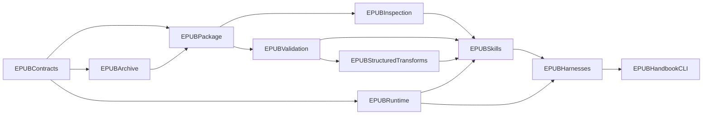

# Swift 核心库与 macOS GUI 实施计划

> 状态：S0 已完成；S1 的 archive / container / OPF / package inspection 基座和 S2 的 AppKit 只读垂直切片已实现。写入 transaction、text invariance 和 popup normalize 仍未实现。
>
> 前置：先完成 [三层项目重构计划](2026-06-20-project-three-layer-refactor-plan.md) 的 R0、R1；Swift runtime 的 registry / harness 接口必须服从该计划的 contract。

## 目标与边界

本计划只负责用 Swift 实现 agent-neutral core、generic plugin runtime 的首批 provider，以及 AppKit-first macOS 产品表面。它不删除 Python，不重写现有 skill，也不把 GUI 做成 Python subprocess 前端。

首个可交付闭环是：

```text
选择 EPUB → Swift preflight → InspectionReport → ExecutionPlan
→ 用户确认 → Swift popup footnote normalize → text invariance
→ 新 output EPUB + RunReport
```

能力必须先在 CLI / fixture / Python 双跑中通过，再进入 GUI。iOS 只在 macOS 闭环稳定后使用同一个 Swift package 接入。

## 工具链与版本

| 项目 | 选择 | 规则 |
|---|---|---|
| 编译器 | Xcode 26.5 / Apple Swift 6.3.2 | 采用当前本机最新正式 Swift；Swift language mode 6。 |
| 核心与 CLI | SwiftPM | `swift-tools-version: 6.3`；业务逻辑和测试只在 package 内。 |
| Xcode 工程 | Tuist 4.200.5 | 以 `Project.swift` 为 source of truth；生成 workspace 不提交。 |
| 工具版本 | mise | 在 `mise.toml` 固定 Tuist；升级工具必须独立验证。 |
| macOS UI | AppKit-first + 少量 SwiftUI hosting | 不使用纯 SwiftUI App。 |
| iOS UI（后续） | UIKit 文件流 + SwiftUI 功能页 | 不复制 macOS 的文件路径语义。 |

部署目标：macOS 15；iOS target 创建时为 iOS 18。SDK 仍使用 Xcode 26.5 提供的 macOS / iOS 26.5 SDK；高版本 API 以 feature availability 分支处理。

### 2026-06-20 已实施基线

- `swift/` 是 Swift tools 6.3 / language mode 6 的 package，已实现 `EPUBContracts`、`EPUBRuntime`、`EPUBArchive`、`EPUBPackage`、`EPUBInspection` 与 `EPUBStructuredTransforms`；SwiftPM unit tests 覆盖 report/plan、provider policy、安全 archive path、container/OPF、inspection 和 SwiftSoup XML-mode XHTML attribute transform。
- 读取 XML 固定结构直接使用 Foundation `XMLParser`；可接受规范化 XHTML 写回的 transform 使用 SwiftSoup `2.13.5` `parseXML(...)`。写入能力进入产品前仍必须补齐 transaction、红线 validator、EPUB lint 和 fixture 双跑。
- `gui/Project.swift` + `Tuist.swift` 已生成 `HandbookMac` 和 `HandbookMacTests`。初始窗口是 AppKit，使用 sandbox security-scoped file access；它只调用 Swift `PackageInspector` 并显示 `InspectionReport`，不调用 Python 或读取 `SKILL.md`。

## Swift Package 结构

```text
swift/
├── Package.swift
├── Package.resolved
├── Sources/
│   ├── EPUBContracts/       # 对应 contracts/ 的 Swift Codable 值类型
│   ├── EPUBArchive/         # ZIP、mimetype、path safety
│   ├── EPUBPackage/         # container、OPF、manifest、spine、nav/NCX
│   ├── EPUBInspection/      # 只读 preflight facts
│   ├── EPUBValidation/      # text/anchors/metadata/cover redlines
│   ├── EPUBStructuredTransforms/ # SwiftSoup XML-mode XHTML 结构化变换
│   ├── EPUBRuntime/         # registry、workspace、gate、transaction、events
│   ├── EPUBSkills/          # Swift SkillPlugin implementations
│   ├── EPUBHarnesses/       # Swift HarnessPlugin implementations
│   └── EPUBHandbookCLI/     # JSON / JSONL command surface
├── Tests/
│   ├── EPUBContractsTests/
│   ├── EPUBArchiveTests/
│   ├── EPUBPackageTests/
│   ├── EPUBInspectionTests/
│   ├── EPUBValidationTests/
│   ├── EPUBStructuredTransformsTests/
│   ├── EPUBRuntimeTests/
│   ├── EPUBSkillsTests/
│   ├── EPUBHarnessesTests/
│   ├── EPUBHandbookCLITests/
│   └── Fixtures/
└── README.md
```

### 模块依赖



| Module | 责任 | 禁止依赖 |
|---|---|---|
| `EPUBContracts` | `ArtifactReference`、`Finding`、report、plan、manifest、error、event。 | ZIP/XML/UI、Python、prompt。 |
| `EPUBArchive` | 安全 ZIP 读取 / 写入、entry order、`mimetype` stored / first、路径逃逸阻断。 | agent、AppKit、业务排版判断。 |
| `EPUBPackage` | container、OPF、manifest、spine、nav、NCX、相对路径。 | 自动纠错正文或 UI。 |
| `EPUBInspection` | preflight 与事实扫描。 | 写入 EPUB。 |
| `EPUBValidation` | 正文不变性、锚点、metadata、spine、cover、加密标记。 | 修改输入以掩盖错误。 |
| `EPUBStructuredTransforms` | SwiftSoup XML-mode 的白名单 XHTML DOM 变换和 path map。 | 未经批准的语义改写、任意 HTML 编辑器。 |
| `EPUBRuntime` | registry、workspace、gate、transaction、取消、event stream。 | 具体 EPUB 规则、shell 路径、UI。 |
| `EPUBSkills` | `PackageInspectSkill`、`TextInvarianceSkill`、`PopupFootnoteNormalizeSkill`。 | GUI 状态、Markdown skill parsing。 |
| `EPUBHarnesses` | `PreflightHarness`、首个 `CleanupHarness`。 | agent prompt、Python command array。 |
| `EPUBHandbookCLI` | 参数、JSON result、JSONL event、exit code。 | 业务算法复制。 |

基础包使用 `ZIPFoundation`；`EPUBStructuredTransforms` 额外固定 `SwiftSoup 2.13.5`，只用于明确授权的 XHTML DOM 结构化变换；Swift CLI 接入时再引入 `swift-argument-parser`。使用 `Foundation`、`FoundationXML`、`Codable`、Swift Testing；不使用 PythonKit、CocoaPods、Carthage 或大型 DI / reactive framework。

2026-06-20 决定：可接受 XHTML 规范化重写，不要求 source-level 最小 diff。因此 SwiftSoup 可调用 `parseXML(...)` 与 DOM serialization；但每次 apply 仍必须写入新的 output artifact，并保留 before、红线校验、EPUB lint 与人工 diff review。`EPUBArchive`、`EPUBPackage` 的 ZIP / OPF 读取仍直接使用 ZIPFoundation / Foundation `XMLParser`，不依赖 SwiftSoup。

## Swift runtime 与 Python 的关系

Swift runtime 遵守项目重构计划中的 manifest / registry 设计。它不读取 `SKILL.md`，也不调用 `scripts/*.py`。

| 场景 | 允许的 provider | 原因 |
|---|---|---|
| Swift 单元、CLI integration、parity test | Swift + PythonProviderAdapter | 双跑对比，Python 是 agent / CLI provider 与 oracle。 |
| macOS App 正常运行 | Swift provider only | 避免 Sandbox、环境版本与取消语义问题。 |
| iOS App | Swift provider only | iOS 不存在可依赖的 Python runtime。 |
| 未迁移 capability | Python CLI / agent 继续可用；GUI 显示 unavailable。 | 不伪装支持，也不分裂行为。 |

Python bridge 只使用 request/result JSON 文件：

```text
Swift parity runner → request.json → PythonProviderAdapter
Swift parity runner ← result.json  ← PythonProviderAdapter
```

request 包含 artifact、mode、workspace、approval token；result 包含 normalized report、plan、output digest、exit code。它不传递 Swift object、GUI object 或 Python object。

## 首批 Swift capability

| Capability ID | Swift provider | Python 对照 | 进入 GUI 的门槛 |
|---|---|---|---|
| `epub.package.inspect` | `PackageInspectSkill` + `PreflightHarness` | `epub_preflight_harness.py` / `epub_ai_harness.py`。 | blocker、finding severity、exit code 对齐。 |
| `epub.text.invariance` | `TextInvarianceSkill` | `validate_text_invariance.py`。 | text、anchors、metadata、spine、cover 对照通过。 |
| `epub.notes.popup-normalize` | `PopupFootnoteNormalizeSkill` | popup skill、converter、`validate-popup-notes.sh`。 | 保留既有图标、redline、popup validator 与 EPUB lint 全通过。 |
| `epub.structure.normalize` | 后续。 | `epub_structure_tool.py`。 | 先只有 dry-run / path map；apply 后置。 |
| `epub.package.merge-split` | 后续。 | `epub_package_tool.py`。 | 不在首个 GUI 范围。 |

首个写入 capability 选择 popup footnote，是因为它有明确结构约束、现有 demo、validator 和“保留已有本地图标”的回归要求，能证明 transaction / gate 设计是否正确。

## macOS GUI 设计

### Tuist 工程

```text
gui/
├── Project.swift
├── Tuist/Config.swift
├── Config/
│   ├── Debug.xcconfig
│   └── Release.xcconfig
├── Targets/
│   ├── HandbookMac/
│   │   ├── App/
│   │   ├── Windowing/
│   │   ├── Navigation/
│   │   ├── Features/
│   │   │   ├── Preflight/
│   │   │   ├── Cleanup/
│   │   │   ├── Report/
│   │   │   └── Settings/
│   │   ├── Hosting/
│   │   └── Resources/
│   ├── HandbookMacTests/
│   └── HandbookMacUITests/
├── README.md
└── .gitignore
```

`HandbookMac` 以 local Swift package dependency 引用 `../swift`。Tuist manifest、xcconfig、source 和测试入 Git；生成的 `.xcworkspace` / `.xcodeproj`、DerivedData、`.build` 不入 Git。

```sh
mise install
cd gui
tuist generate
open *.xcworkspace
```

### AppKit-first 的边界

| 区域 | 技术 | 原因 |
|---|---|---|
| 生命周期、菜单、快捷键、窗口 | AppKit `NSApplicationDelegate` / window controller | macOS 原生多窗口与 command 行为。 |
| 项目导航、任务队列、复杂表格、inspector | `NSSplitViewController`、`NSOutlineView`、`NSTableView` | 适合 EPUB 文件、分阶段 plan 和审计记录。 |
| 导入、导出、最近项目 | `NSOpenPanel`、`NSSavePanel`、security-scoped bookmark | 支持 Sandbox、用户授权与持久访问。 |
| 报告详情、设置、简短表单、空状态 | SwiftUI + `NSHostingController` | 局部复用高，不接管 AppKit navigation。 |
| 长任务进度、取消、错误 | AppKit feature controller 订阅 `RunEvent` | 保留明确的取消 / rollback / retry 状态。 |

View 只消费 feature view model；view model 调用 `EPUBHarnesses` / `EPUBRuntime` 的公开 API。任何 EPUB 规则、XML 修改、ZIP 写入或 prompt 生成都不出现在 UI target。

### Sandbox 与输出纪律

- UI 负责选取并开始访问 security-scoped URL；Swift core 只接收已授权的 `URL`。
- 输入永远只读，写入必须输出到用户选定位置或 App work directory 的新 artifact。
- 任何 apply 都先将原始输入复制为 `before/source.epub`；`Transaction` 在 redline 或 popup validator 失败时删除 staged output。
- 默认不在 GUI 内运行外部 Python、Java、字体子集或图片压缩工具；将来 capability probe 可报告它们，但不能默默降级。

## 分阶段实施计划

### S0 — 接入项目 contract

- 等待项目重构 R0、R1 完成；读取 capability manifest、schema 和 Python baseline。
- 在 `swift/` 创建 package、test fixture 目录和 `EPUBContracts`。
- 对每一 Swift `Codable` 类型做 JSON round-trip 与 schema compatibility test。

**完成标准：** Swift 能读写项目级 contract；没有业务逻辑落在 GUI 或 `scripts/` 的新分支里。

### S1 — archive / package / inspection

- 实现 archive path 安全、ZIP entry 规则、container、OPF、manifest、spine、nav / NCX。
- 实现 `PackageInspectSkill` 与 `PreflightHarness` 的只读模式。
- 提供 `epub-handbook-swift inspect <input> --format json`、`plan <input> --format json`。
- 运行 Python 与 Swift baseline 对比。

**完成标准：** fixture 的 blocker、severity、关键 package facts 和 exit code 对齐；没有写入输入。

### S2 — Tuist 与 AppKit 只读垂直切片

- 创建 `mise.toml`、Tuist project、`HandbookMac`、unit test 和 UI test target。
- 完成 AppKit 主窗口、文件选择、Sandbox entitlement、security scope 生命周期和 report 展示。
- GUI 调用 Swift `PreflightHarness`，不调用 Python。

**完成标准：** 用户可选择 demo EPUB，查看 report，取消任务或文件授权失败时得到结构化错误；输入文件字节不变。

### S3 — redline 与 popup footnote Skill

- 实现 `TextInvarianceSkill` 与可选择 checks。
- 实现 `PopupFootnoteNormalizeSkill`，只接受 manifest 声明的白名单变换。
- 实现 `Workspace`、`Transaction`、approval gate、rollback 与 event stream。
- 以 Python 对照、popup validator、EPUB lint、人工 diff review 验证输出。

**完成标准：** Swift CLI 可完成一个可审计的 popup normalize transaction；macOS GUI 可在用户批准后执行该单一能力。

### S4 — CleanupHarness 与 plan UI

- 实现 plan dependency、manual review gate、RunEvent、cancel / rollback。
- GUI 以任务队列展示 `ExecutionPlan`、阻断项、批准点、进度和 artifact。
- CLI 同步提供 JSON result 与 JSONL event 模式。

**完成标准：** CLI 和 GUI 使用同一 plan；输出路径、before、after、reports 和 transaction log 可审计。

### S5 — 高风险能力逐项扩展

- 先实现 structure normalize dry-run 与 path map。
- 再按独立 capability 迁移 apply、EPUB3 migration、legacy note fallback、CSS cleanup。
- merge / split、封面、字体、图片、Kindle 外部工具保持后置。

**完成标准：** 每项能力都有 manifest、fixture、Python dual-run、redline、对应 validator 和人工 review 证据。

### S6 — iOS 准备与接入

- 只在 S4 稳定后创建 `HandbookiOS` target。
- UIKit 使用 `UIDocumentPickerViewController` / `UIDocumentBrowserViewController` 做文件入口；SwiftUI 仅用于 report、settings、confirmation。
- 首期 iOS 仅公开 inspection 与无需外部工具的 Swift capability。

**完成标准：** iOS 与 macOS 没有两套 EPUB 逻辑；不支持的 capability 明确显示 unavailable。

## 验证矩阵

| 改动 | 至少运行 |
|---|---|
| Swift contracts / core | `cd swift && swift test`；schema compatibility；fixture golden tests。 |
| Swift CLI | integration tests；Python normalized baseline comparison；exit code comparison。 |
| macOS Project.swift | `mise install`、`cd gui && tuist generate`。 |
| macOS App | 生成 workspace 后运行对应 `xcodebuild test`。 |
| EPUB 写入 | Swift / Python text invariance、`scripts/validate-popup-notes.sh --epub <artifact>`（如适用）、`scripts/epub_lint.py <artifact>`、人工 diff review。 |
| 任何改动 | `git diff --check`。 |

## 不做

- 不让 macOS / iOS GUI 调用 PythonKit 或用户环境中的 Python。
- 不将 SwiftUI 作为整个 macOS App 的导航与生命周期框架。
- 不先做 Kotlin、Rust font sidecar、WASM、Java binding、云同步或在线书库。
- 不在没有 Python parity、contract、fixture、validator 的情况下把 Python capability 宣称为 Swift 已接管。
- 不在首个 GUI 中提供任意 XHTML 编辑或整条自动 cleanup loop。
